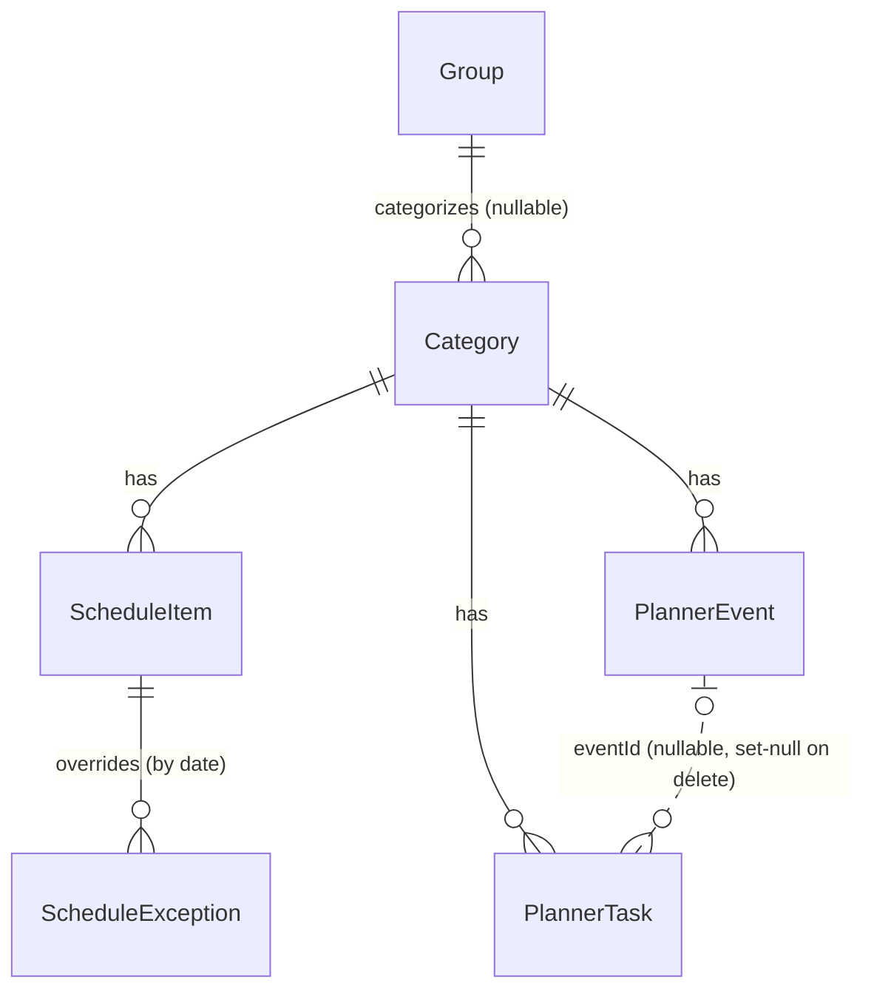

# Data model

Working draft of the domain model, reverse-engineered from the current
`localStorage`-backed implementation (`src/features/planner/{types,constants,store}.ts`).
All open questions below are now resolved — this is the shape the Prisma
schema should be written against.

This app is single-user by design (personal planner, not a multi-tenant
product) — there is no `User` entity and no plan to add one. Everything below
belongs to the one person running the app, currently all in one
`localStorage` blob (`planner-storage`).

**Conventions decided for the DB (see "Resolved decisions" below):**
- Dates → `DateTime @db.Date` (Postgres `DATE`), API layer round-trips as `YYYY-MM-DD`.
- Times-of-day → `DateTime? @db.Time` (Postgres `TIME`), nullable = "no time" (replaces
  the `'Sin horario'` / `NO_TIME` sentinel). Prisma Client returns these as a `Date` on
  the epoch date (`1970-01-01THH:MM`); the API layer formats to/from `"HH:MM"` so no
  route has to know that.
- Ids → `String @id @default(uuid())`, matching the `crypto.randomUUID()` the client
  already generates (`shared/utils.ts` `generateId`) — ids can keep being minted
  client-side for optimistic writes, the DB default just backstops server-created rows.

## Entities

### Group

`types.ts:10`. User-defined bucket for categories (e.g. "Cursos", "Distención").

| field | type | notes |
|---|---|---|
| id | String @id | uuid |
| name | String | |

Deletion is blocked in the UI while any `Category` still references it
(`store.ts:181` `deleteGroup`) — model as `onDelete: Restrict`, not cascade.

### Category

`types.ts:15`. The "category" a schedule slot, event, or task belongs to.

| field | type | notes |
|---|---|---|
| id | String @id | uuid |
| groupId | String?, fk → Group | `onDelete: Restrict` |
| name | String | |
| hue | Int | OKLCH hue angle (0–360), drives all category coloring (`utils.ts:10-20`) |

Deleting a category cascades to its schedule, events, and tasks
(`store.ts:221-233`) — model as `onDelete: Cascade` on those three.

### ScheduleItem

`types.ts:24`. A recurring weekly (or biweekly) class slot, bounded by a
date range — this is the *template*, not materialized per-week occurrences.
Occurrences are computed on read (`utils.ts:92-135`, `scheduleAppliesOn` +
`recurringForRange`), and that stays true in the DB (see decision 1 below).
`title` is optional (empty string falls back to the category name wherever
it's displayed, see `scheduleTitleFor`).

| field | type | notes |
|---|---|---|
| id | String @id | uuid |
| categoryId | String, fk → Category | `onDelete: Cascade` |
| title | String | |
| weekday | Int 0–6 | 0 = domingo … 6 = sábado (JS `Date#getDay()` convention) |
| start | DateTime @db.Time | always set — a schedule slot always has a time |
| end | DateTime @db.Time | always set |
| startDate | DateTime @db.Date | first date the slot can occur on |
| endDate | DateTime? @db.Date | inclusive; `null` = no end |
| interval | Int (1 \| 2) | 1 = weekly, 2 = biweekly (parity anchored to `startDate`, see `scheduleAppliesOn`) |

### ScheduleException

`types.ts:43`. A per-occurrence override for a `ScheduleItem`, keyed by the
occurrence's calendar date, so a single class can be cancelled or edited
(time/title) without touching the recurring rule or splitting it into extra
`ScheduleItem` rows. Same pattern as iCal `EXDATE`/`RECURRENCE-ID`. Applied in
`recurringForRange` (`utils.ts:109-135`) when expanding a `ScheduleItem` into
occurrences for a date range.

| field | type | notes |
|---|---|---|
| id | String @id | uuid |
| scheduleId | String, fk → ScheduleItem | `onDelete: Cascade` |
| date | DateTime @db.Date | the specific occurrence this overrides |
| cancelled | Boolean @default(false) | `true` = this occurrence is deleted; other fields unused |
| title | String? | override, only meaningful when not cancelled |
| start | DateTime? @db.Time | override, only meaningful when not cancelled |
| end | DateTime? @db.Time | override, only meaningful when not cancelled |

`@@unique([scheduleId, date])` — the store already looks up at most one
exception per `(scheduleId, date)` pair (`store.ts:265,282`); worth enforcing
in the schema instead of just in app code.

Deleting a `ScheduleItem` cascades to its exceptions — model as
`onDelete: Cascade`.

### PlannerEvent

`types.ts:54`. A calendar event, possibly spanning multiple days
(`isMultiDay`, `utils.ts:59-61`). No `deadline` field — deadline-ness is
derived from shape, see below.

| field | type | notes |
|---|---|---|
| id | String @id | uuid |
| categoryId | String, fk → Category | `onDelete: Cascade` |
| title | String | |
| startDate | DateTime @db.Date | replaces `y/m/d` — no more 0-indexed month once this is a real date |
| endDate | DateTime @db.Date | replaces `endY/endM/endD`; inclusive |
| start | DateTime? @db.Time | `null` replaces the `'Sin horario'` sentinel — "no start time" |
| end | DateTime? @db.Time | `null` replaces the sentinel — "no end time" |

Both start and end can independently be unset. An event with no start
but a set end (`isDeadlineEvent`, `utils.ts:69-71`) reads as a due time
rather than a scheduled block — it renders as a thin marker in the week
view ("franja"), and it's the signal `EventModal` uses to offer "Crear
tarea" on creation (`store.ts:294-329` `saveEvent`): checking it spawns a
linked `PlannerTask` in the backlog whose `deadline` is copied from the
event's own date. With neither start nor end set, the event is
untimed/all-day-style.

### PlannerTask

`types.ts:72`. A to-do, optionally linked back to a `PlannerEvent` (e.g.
"review for this exam"). `deadline` is a separate, independent field from
the day assignment — a task can be undated (backlog) and still carry a
deadline for prioritization, or be scheduled on a day with no deadline.

| field | type | notes |
|---|---|---|
| id | String @id | uuid |
| categoryId | String, fk → Category | `onDelete: Cascade` |
| eventId | String?, fk → PlannerEvent | `onDelete: SetNull` — cleared (not cascaded) when the linked event is deleted (`store.ts:330-335`) |
| title | String | |
| assignedDate | DateTime? @db.Date | replaces the `y/m/d` trio; `null` = backlog (unscheduled). Collapsing three ints that were only ever null *together* into one nullable column enforces that invariant by construction instead of by convention |
| deadline | DateTime? @db.Date | due date shown on the task card for prioritization; independent of `assignedDate` |
| start, end | DateTime? @db.Time | same "null = no time" convention |
| done | Boolean @default(false) | collapses `doneMap` (see below) into a real column |

### TimeDivision

`store.ts:39`. Was a flat `string[]` of `HH:MM` labels used as the week
view's hour gridlines/dividers, user-editable in Settings
(`addTimeDivision`/`deleteTimeDivision`, `store.ts:174-177`). Read side
already sorts by time-of-day at render time (`SettingsView.tsx:42`,
`WeekView.tsx:160`), so storage order doesn't matter — a row-per-value table
with a uniqueness constraint is a direct match for the existing
add/delete-by-value store actions, and simpler than a single scalar array
column or a one-row config table.

| field | type | notes |
|---|---|---|
| id | String @id | uuid |
| value | DateTime @db.Time, @unique | same Time convention as every other time-of-day field; `@unique` replaces the `includes()` de-dupe check in `addTimeDivision` |

No relationships — standalone table, single global list, not shown in the
ER diagram below.

### (derived, no longer needed) doneMap

`store.ts:38`. Was a separate `Record<taskId, boolean>` alongside `tasks`,
keyed only by `PlannerTask.id`. Resolved: collapses into `PlannerTask.done`
(above) — no reason to keep it as a side table once there's a real column to
put it on.

## Relationships

## Resolved decisions

1. **Recurring occurrences stay computed, not stored.** `ScheduleItem`
   remains a template; there's no table of individual class instances in the
   DB either. This avoids a materialization job, at the cost of any API that
   returns "events for week X" having to run the same expansion server-side
   that `recurringForRange` does client-side now — that expansion logic
   should move to the API layer (or a shared package it imports), not be
   reimplemented.

2. **Date/time representation: real `DateTime` columns, split by kind.**
   - Pure dates (`ScheduleItem.startDate/endDate`, `PlannerEvent.startDate/endDate`,
     `PlannerTask.assignedDate/deadline`, `ScheduleException.date`) → `DateTime @db.Date`.
     This also retires the `y/m/d` int triples and the 0-indexed-month
     convention entirely — dates round-trip as ISO strings past the DB
     boundary, so there's no month-indexing footgun left to carry into the
     API.
   - Times-of-day (every `start`/`end`, plus `TimeDivision.value`) →
     `DateTime? @db.Time` (nullable except `ScheduleItem.start/end`, which are
     always set). Chosen over a plain `"HH:MM"` string so the DB enforces
     that these are actually valid times, at the cost of the API layer having
     to convert Prisma's epoch-dated (`1970-01-01THH:MM`) return value to and
     from `"HH:MM"` — that conversion should live in one shared place in the
     API layer, not be repeated per route. `null` replaces the `'Sin horario'`
     (`NO_TIME`) sentinel string used today.
   - `PlannerTask`'s `y/m/d` trio (nullable only ever as a group) collapses
     into the single nullable `assignedDate` — see the PlannerTask table above.

3. **No migration from the existing `localStorage` blob, no DB seed.** The
   current `localStorage` data (and the `constants.ts` `DEFAULT_*`/`buildDefault*`
   demo seed used to populate it) is disposable — the user is repopulating
   groups/categories/schedule/events/tasks by hand against the DB. So there is
   no import route and no seed script to build; the Prisma tables just start
   empty. `constants.ts`'s `DEFAULT_GROUPS`/`DEFAULT_CATEGORIES`/`DEFAULT_SCHEDULE`/
   `buildDefaultEvents`/`buildDefaultTasks` go away entirely once the store no
   longer needs demo data to boot with.
4. **The zustand domain slices are redundant once Prisma is live, and get deleted.**
   `groups`, `categories`, `schedule`, `scheduleExceptions`, `events`, `tasks`,
   `doneMap`, and `timeDivisions` on `PlannerState` (`store.ts:31-39`) —
   along with every action that mutates them and the whole `persist`/`migrate`/
   `partialize` wrapper (`store.ts:132-429`) — are the `localStorage` copy of
   what the DB now owns. Once the Prisma schema + API routes exist, these
   become server state fetched/mutated through the API (e.g. via the
   `@tanstack/react-query` + `Providers`/`queryClient` setup already added in
   `4104dbd`/`96ae3c8`), not client state duplicated in a persisted store.
   What stays in zustand is UI-only state that was never meant to survive a
   reload as domain data: `view`, `selectedCategoryId`, `monthOffset`,
   `weekOffset`, `weekZoom`, `settingsSubview`, and the four modal states
   (`eventModal`/`taskModal`/`scheduleModal`/`categoryModal`) — none of that
   needs `persist` either, since it's meant to reset on reload.

## Non-goals of this doc

No `User`/authentication/session model (single-user app, see above), no API
route shapes. There's no localStorage import and no DB seed to plan (decision
3) — data is repopulated by hand. The actual API routes, the API layer's
date/time conversion helpers, and deleting the zustand domain slices/`persist`
wrapper in favor of API-backed state (decision 4) are implementation, not
modeling, and are follow-ups once the Prisma schema itself is written.
